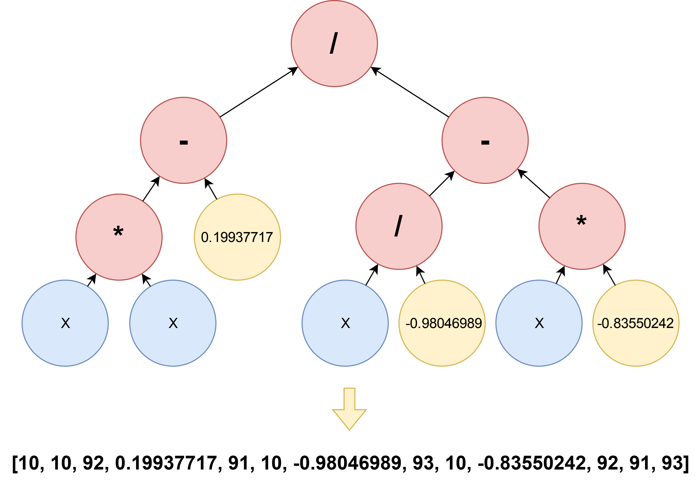

# easyFastGP

Base implementation of genetic programming in Python with memory-efficient tree representation and usage of Numba for
better performance. Designed for processing large and deep trees.

## Introduction

*easyFastGP* is a genetic programming framework in Python for fast processing of large and deep trees. The framework is
designed to solve symbolic regression problems. The implementation was created as part of a project in my master's
degree in computer science. The following goals were taken into account during the development:

1. Modular structure
    - *easyFastGP* is modular and can be used as a basis for various experiments with GPs.
    - Initialisation, selection, crossover, mutation and fitness calculation can be easily replaced or extended. The
      following schematic diagram shows the different components of the implementation.

      `will follow`

2. Processing of large and deep trees
    - Due to problems such as bloat and introns, trees can grow fast in GPs. The implementation uses a post-order
      representation in which functions and terminals are represented as specific IDs. Depths of 2000 with 1 million
      nodes have already been successfully tested.

<figure style="text-align:center;">

<figcaption>
<i>Used postorder tree representation</i>
</figcaption>
</figure>

3. Good performance
    - Normally, the tree evaluation takes up most of the total runtime. Due to the chosen tree encoding, the trees in
      *easyFastGP* can be evaluated with numba precompiled methods. It is also possible to evaluate populations
      parallel.
    - In a simple synthetic test run, *DEAP* and *easyFastGP* were compared. The aim was to perform a symbolic
      regression of the function f(x) = x² * (x - 1)² * (x + 1)². From 5 runs I got the following results: DEAP
      processed an average of 58301 nodes per sec. and *easyFastGP* 4158681 nodes per sec. Thus in my comparison *
      easyFastGP* was about **~71 times** faster.

      following parameters were used: max gen.: 500, individuals: 500, prob. crossover: 90%, prob. mutation: 3%,
      number test cases: 2048, initialisation: Half&Half 2-6, selection: tournament k=7, number of processors: 4, tree
      depth: 90 (maximum possible from DEAP).

## Installation

The execution of *easyFastGP* requires the following libraries: `numpy`, `numba`, `joblib`.

## Usage

There are two examples (a real problem and a synthetic problem) in the folder `experiments`.

### Configuration
The parameters of a GP run can all be found in the `parameters.py` file.

### Tree definition
The tree representation requires some work when new functions are added. Currently there are: add (*ID 90*), sub (*ID
91*), mult (*ID 92*) and div (*ID 93*). Terminals and functions are identified by special IDs which are set in
program.py. If a new function needs to be added, function_set must first be adjusted with the special identification of
the function. The dictionary needs the arity of the function as value.

The method evaluate_postorder from program.py performs the evaluation of the tree. The logic of the new function must be
integrated in this method. The best way to do this is to use numpy functions, as they work very well with Numba.

It is important that the defined ranges `start_index_functions`, `start_index_terminals`, `index_eph_constant`,
`lower_limit_constants` and `upper_limit_constants` do not violate each other, otherwise the trees will not be evaluated
correctly.